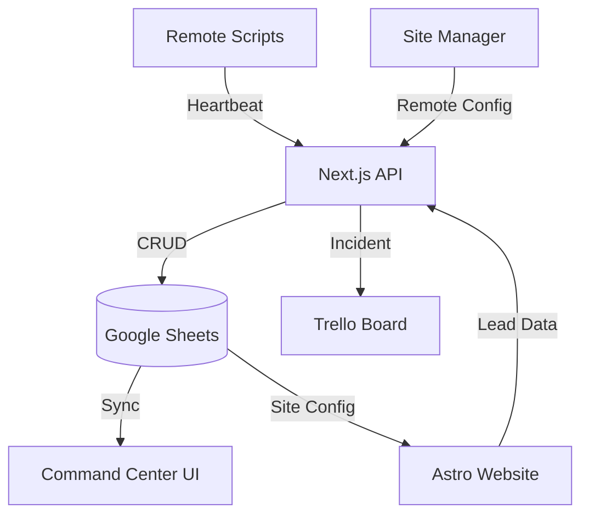

# 📟 Empower Automation: Unified Business OS

A high-fidelity, Tech-Noir inspired Command Center for the modern automation agency. This is not just a dashboard; it is a full-service **Business OS** that bridges technical monitoring, lead intelligence, and remote production management.

## 🌌 The Vision
Managing **100+ distributed automation scripts** across multiple client accounts creates a "visibility gap." This platform solves that by centralizing heartbeats, prospect tracking, and site configuration into a single, secure, and aesthetically premium interface.

---

## 🛠️ Core Capabilities

### �️ Core Business Modules

#### 👥 Leads Intelligence (CRM)
*   **Centralized Intake**: A secure API endpoint for external sites (Astro, Webflow) to inject prospects directly into your dashboard.
*   **Prospect Tracking**: View name, company, and technical notes on every lead in a clean, filterable interface.

#### 📊 Marketing ROI Dashboard
*   **Performance Tracking**: Visual tracking of script/template performance (Impressions vs. Leads).
*   **Template Sync**: Direct link to your social media libraries for one-click deployment logic.

#### ⚙️ Remote Site Manager
*   **Dynamic Configuration**: Update your production website's marquee text, contact details, and hourly rates remotely from the dashboard.
*   **Infrastructure Control**: No-code updates to site assets, bypassing the need for manual redeployments or GitHub pushes.

#### 📡 Technical Health (The Heartbeat)
*   **Auto-Registration**: Deploy any script (Apps Script, Python, Node) and it instantly appears on the dashboard upon the first ping.
*   **Logic of Time**: Automatic status cycling (Nominal → Silence → Failure) based on real-time telemetry.
*   **Remote Kill-Switch**: Disable or Enable scripts globally from the dashboard.

### 🚨 Incident Engineering
*   **Trello Integration**: Automatic "High Priority" card creation on script failure, ensuring zero-error silence.

---

## 🏗️ Technical Architecture

---

## 💼 Case Study: Agency Transformation
### The Problem
Managing a massive distributed network across various Google accounts was unsustainable. Monitoring was reactive, lead tracking was fragmented, and clients lacked visibility into the value of their automation subscriptions.

### The Solution: The "Business OS"
By leveraging **Google Sheets as a low-code database** and **Next.js for a high-performance frontend**, we built a system that scales infinitely with near-zero infrastructure costs.

### Results
- **90% Faster Response**: Trello alerts ensured failures were addressed before clients noticed.
- **Unified Sales Loop**: Lead generation from the public portfolio is captured directly inside the Agency OS.
- **Higher Retention**: Bespoke status portals turned a "hidden" service into a visible, branded asset for every client.

---

## � Integration & Security
The dashboard uses a secure handshake for all external connections. 

**API Key Authentication**:
- **Key**: `secret123` (Configurable via `DASHBOARD_API_KEY`)
- **Usage**: Use this key in headers as `x-api-key` for all Astro lead submissions or script heartbeats.

---
Built by **Nicola Berry** | **Empower Automation**
🔗 [empowerautomation.co.uk](https://empowerautomation.co.uk)